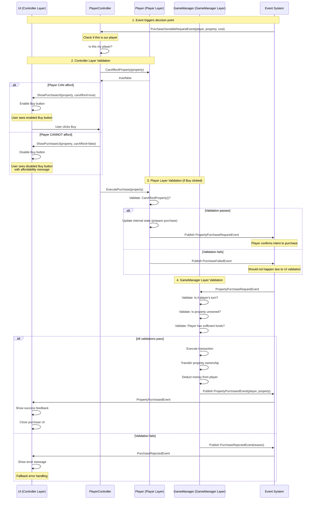

# Validation Layer Flow

## Overview

All player decisions follow a three-layer validation system to ensure that the game follows
the rules and the user experience is consistent. The layers are as follows:

1. **Controller Layer (UI/AI):** Prevents invalid actions before calling Player methods
   - UI reactively enables/disables buttons based on current state
   - AI evaluates decision logic and filters to valid options
2. **Player Layer:** Validates player's own state and capabilities
   - Checks players money, owned properties, cards, etc
   - Provides validation methods (`CanAfford___()`, `Has___()`, etc)
3. **GameManager Layer:** Validates game rules and enforces global state
   - Verifies turn order, ownership, phase correctness
   - Checks against current RuleSet for validity
   - Acts as the final arbiter of rules and compliance

## Detailed Example: Property Purchase Flow

This sequence diagram shows the complete 3-layer validation for a property purchase decision.



**Recap:**
- **Layer 1 (UI)**: Prevents the click from happening if player can't afford
- **Layer 2 (Player)**: Double-checks state before publishing intent
- **Layer 3 (GameManager)**: Final authority on whether transaction is valid
- **Redundancy is intentional**: Each layer provides a safety net

---

## Validation Summary by Decision

| Decision | Controller Validation | Player Validation | GameManager Validation |
|----------|----------------------|-------------------|------------------------|
| **Property Purchase** | Button enabled only if `CanAffordProperty()` | `CanAffordProperty()` in `ExecutePurchase()` | Verify unowned, player's turn, sufficient funds |
| **Property Upgrade** | Filter UI to show only upgradable properties | `CanUpgradeProperty()` in `ExecuteUpgrade()` | Verify ownership, color group complete, building rules, even building |
| **Property Downgrade** | Filter UI to show only downgradable properties | `CanDowngradeProperty()` in `ExecuteDowngrade()` | Verify ownership, has improvements, even building rules |
| **Rent Payment** | N/A (automatic) | N/A (automatic execution) | Verify ownership, calculate correct amount, handle insufficient funds |
| **Jail Release (Card)** | Show button only if `HasGetOutOfJailCard()` | `HasGetOutOfJailCard()` in `ExecuteUseGetOutCard()` | Verify player in jail, card in inventory |
| **Jail Release (Pay)** | Show button only if `CanAffordJailFee()` | `CanAffordJailFee()` in `ExecutePayJailFee()` | Verify player in jail, sufficient funds |
| **Jail Release (Roll)** | Always show (always available) | `CanRollDice()` in `ExecuteRollForRelease()` | Verify player in jail, hasn't exceeded max attempts |
| **Mortgage** | Filter UI to mortgageable properties only | `CanMortgageProperty()` in `ExecuteMortgage()` | Verify ownership, no improvements, not already mortgaged |
| **Unmortgage** | Filter UI to unmortgageable properties, show cost | `CanUnmortgageProperty()` in `ExecuteUnmortgage()` | Verify ownership, is mortgaged, sufficient funds |
| **Roll Dice** | Enable button only when `CanRollDice()` | `CanRollDice()` in `ExecuteRollDice()` | Verify player's turn, hasn't rolled this turn, not in special state |
| **End Turn** | Enable button only after mandatory actions done | `CanEndTurn()` in `ExecuteEndTurn()` | Verify has rolled dice, completed mandatory payments, player's turn |
| **Asset Liquidation** | Show only liquidatable assets, calculate values | `GetLiquidatableAssets()`, `CanSatisfyDebt()` | Verify assets owned, validate liquidation values, handle bankruptcy |
| **Card Effects** | N/A (automatic for most) | Validate card in inventory for keepable cards | Verify card effect is legal, execute effect |
| **Collect GO** | N/A (automatic) | N/A (automatic execution) | Verify passed GO or landed on GO, award correct amount |

---

## Key Patterns

### Pattern 1: Triggered Decisions
**Examples**: Property Purchase, Rent Payment, Jail Release

**Flow**: Event fires → Controller validates context → Player validates state → GameManager validates rules

**Controller responsibility**: Check if event applies to this player, validate player can perform action

**Player responsibility**: Double-check own state, publish intent event

**GameManager responsibility**: Final rule validation, execute transaction, publish result

---

### Pattern 2: Available Actions
**Examples**: Property Upgrade, Mortgage, Roll Dice

**Flow**: Player initiates → Controller pre-validates → Player validates state → GameManager validates rules

**Controller responsibility**: Show only valid options, enable/disable UI reactively

**Player responsibility**: Validate state when execution method called

**GameManager responsibility**: Verify game rules, execute action, publish result

**Key difference from Pattern 1**: No triggering event - player chooses when to attempt action

---

### Pattern 3: Automatic Actions
**Examples**: Rent Payment, Collect GO, Most Card Effects

**Flow**: Event fires → Controller executes → GameManager validates and completes

**Controller responsibility**: Receive event, call Player execution method, show feedback

**Player responsibility**: Execute automatically (no validation needed)

**GameManager responsibility**: Validate correctness, handle edge cases (insufficient funds), publish result

**Key difference**: No player decision - these are mandatory/automatic game effects

---

## Exception Cases

### Rent Payment (Automatic with Conditional Flow)
Rent payment is automatic but can trigger Asset Liquidation if player has insufficient funds:
```
ChargeOwnershipFeeEvent fires
  → Controller calls Player.ExecutePayment()
  → Player attempts payment
  → If insufficient funds:
      → Trigger Asset Liquidation flow
      → Player must raise funds
      → Retry payment
  → If still insufficient after liquidation:
      → Player declares bankruptcy
```

### Asset Liquidation (Forced Available Action)
Asset Liquidation is triggered like Pattern 1 but behaves like Pattern 2 once active:
```
Payment fails validation (insufficient funds)
  → Controller shows Property Management UI in Liquidation Mode
  → Player chooses which assets to liquidate (Available Action pattern)
  → Controller validates choices
  → Player executes liquidation
  → GameManager validates and executes
  → Return to original payment flow
```