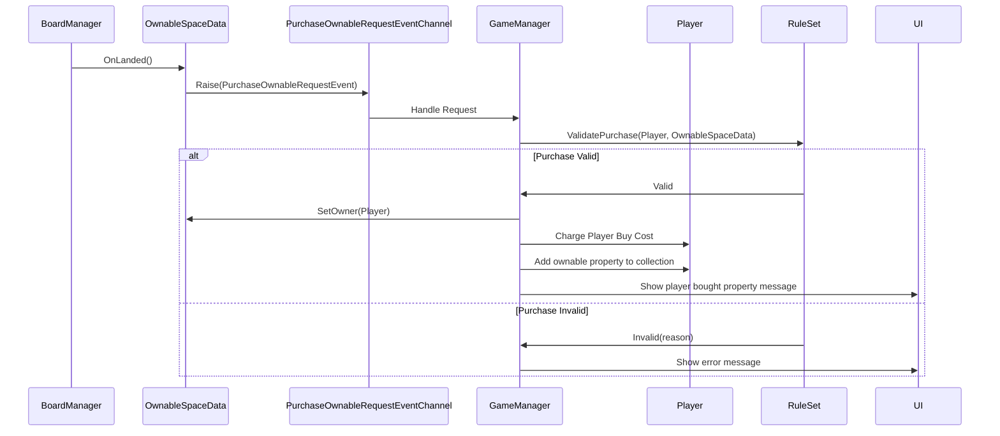
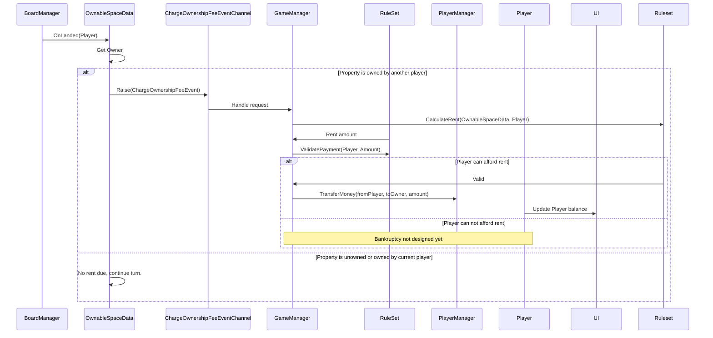

# SpaceData Architecture

## Overview
SpaceData implements an event-driven architecture using ScriptableObjects for game data and 
EventChannels for decoupled communication.

## Core Pattern: Commands vs Queries

### Queries (Direct Calls)
Read-only operations that don't require validation:
```csharp
// Reading state - direct method calls
Color color = spaceData.spaceColor;
Player owner = ownableSpace.GetOwner();
```

### Commands (Events)
State-changing operations that require validation:
```csharp
// Changing state - goes through events
purchaseOwnableRequestEventChannel.Raise(
    new PurchaseOwnableRequestEvent(
        player, spaceData, cost));
```

**Why this separation?**
- GameManager acts as a mediator, running all actions through RuleSet strategies to be validated
- Simple read-only data requests do not need to be events, raises complexity and overhead when simple
  access methods can be used
- Rule of thumb: if there needs to be validation or a state change, use an EventChannel. If you just 
  need to query data, use direct method calls or property access

## Event Flows

> **NOTE:** These diagrams show the intended architecture for SpaceData interactions, and do not reflect
> final implementation of outside system communications (and are bound to change)

### Property Purchase


### Rent Collection


## Adding New Space Types

1. Create a new class inheriting from `SpaceData` (or `OwnableSpaceData` for properties)
2. Create a ScriptableObject asset file named by board position
    - Format: `{position}_{SpaceName}.asset`
    - Examples: `00_Go.asset`, `01_Hebe.asset`, `23_Psyche.asset`
    - **Note:** The asset filename doesn't need to match the class name - board position matters for validation
3. Implement `OnLanded()` to define space behavior
4. Use queries for reading state, raise events for state changes
5. Let GameManager handle validation and state updates

## Important Constraints

### ScriptableObject Class Files
Unity requires ScriptableObject **class definition files** to match their class names exactly:
- Correct: `PropertySpaceData.cs` contains `class PropertySpaceData`
- Wrong: `MySpace.cs` contains `class PropertySpaceData`

**Asset instances** (the `.asset` files) don't have this constraint - they're named by board position.

### Event Channel References
Event channels must be assigned to space instances. For bulk assignment across 40 spaces, we will
develop an editor script to go through each SpaceData and assign its EventChannel assets for easy
hookup.

In the meantime, manual entry is needed.

## Future Extensions
- Card system (see US #360)
- Alternate rulesets